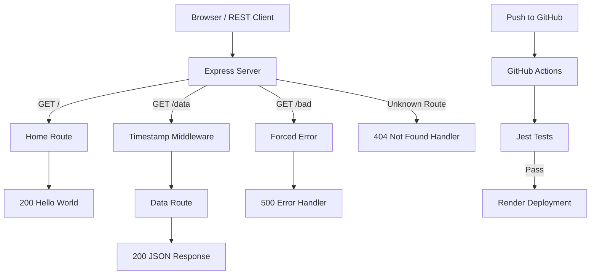

# Server Deployment Practice

A Node.js and Express server created to practice the Node ecosystem, continuous integration, continuous deployment, automated testing, middleware, and cloud deployment.

## Author

Luis Lopez

## Application

This application contains an Express server with several routes used to demonstrate server behavior, middleware, error handling, testing, CI, and CD.

### Routes

- `GET /` - Returns `Hello World`
- `GET /data` - Returns a JSON object containing even/odd values and a timestamp supplied by middleware
- `GET /bad` - Forces a server error and returns a 500 response
- Invalid routes return a 404 response

## Installation

Clone the repository:

```bash
git clone git@github.com:metswin17/server-deployment-practice.git
```

Install dependencies:

```bash
npm install
```

## Environment Setup

Create a `.env` file in the root of the project:

```text
PORT=3000
```

## Running the Application

Start the server:

```bash
node index.js
```

The local server will run at:

```text
http://localhost:3000
```

## Testing

Run the Jest and Supertest test suite with:

```bash
npm test
```

The tests verify:

- Invalid routes return 404
- Server errors return 500
- The root route returns `Hello World`
- The `/data` route returns a JSON object
- Middleware adds a timestamp to `/data`

All 5 required tests are passing.

## Continuous Integration

GitHub Actions automatically installs the project dependencies and runs the Jest test suite when code is pushed to the `dev` or `main` branches.

[View GitHub Actions](https://github.com/metswin17/server-deployment-practice/actions)

## Pull Request

[View Pull Request #1](https://github.com/metswin17/server-deployment-practice/pull/1)

## Deployment

### Development

Dev Branch: `dev`

Dev Deployment: [Live Dev Server](https://server-deployment-practice-0l0d.onrender.com)

### Production

Production Branch: `main`

Production Deployment: [Live Production Server](https://server-deployment-practice-prod-jly8.onrender.com)

## UML / Process Flow



## CI/CD Process

The deployment process for this application is:

```text
Local Development
       ↓
Push to dev
       ↓
GitHub Actions
       ↓
Automated Tests Pass
       ↓
Render Dev Deployment
       ↓
Pull Request: dev → main
       ↓
Merge to main
       ↓
GitHub Actions Run Again
       ↓
Render Production Deployment
```

## Technologies

- Node.js
- Express
- dotenv
- Jest
- Supertest
- GitHub Actions
- Render
